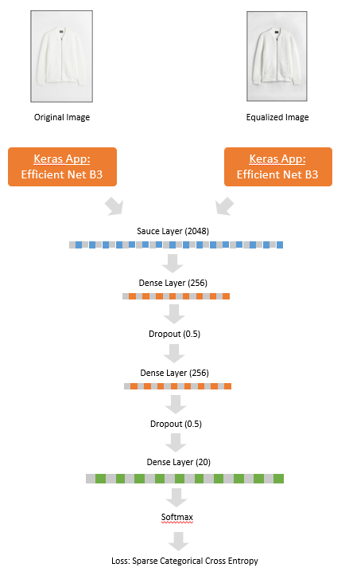
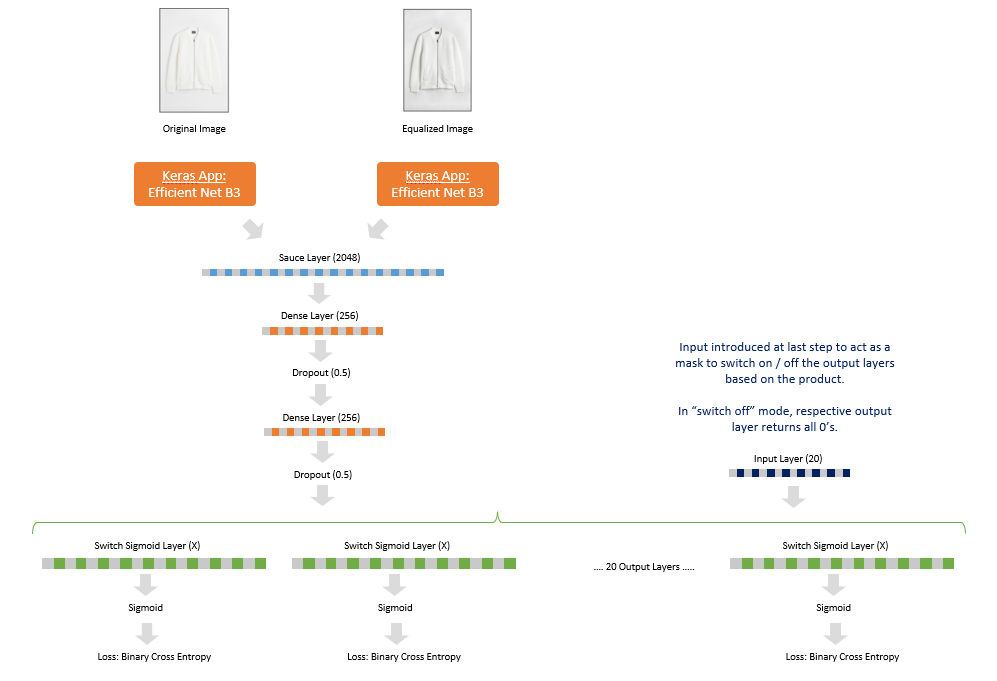

# Automatic category identification and filter mapping for Products using CNNs
### Focus: Fashion E-Commerce

### Introduction
In e-commerce portals, we have thousands, if not millions, of products. With a view to tackle reducing attention spans of customers and lower exclusivity in product portfolios, the capability to have improved searchability within the catalogue is a critical desired outcome for companies operating in this space.

There are primarily two ways that consumers search for products in any e-commerce portal, namely:

1. Using the Search option which performs a free-text search in the names and descriptions of the products
1. Traversing through the categories and sub-categories on the website and then using provided Filters to restrict the number of displayed products

In this project, I would like to focus on improving results for the 2nd route i.e. creating an automated model to help e-commerce site owners & administrators to maximize accuracy of categorization and filtering. Categorization and filtering of products is based on inputs made into a cataloguing system. This creates 2 points of failures:

1. Incorrect or insufficient category mapping primarily due to:
    1. Manual blunders: Men’s trousers categories under Women’s trousers
    1. Insufficient breadth: A pair of unisex shoes only categorized under Men’s shoes
    1. Insufficient depth: A pair of Sneakers only categorized into the top category as shoes and not sub-categorized as Sneakers
1. Insufficient data input for filters eg. Collar type not updated on a Shirt

These issues would lead to inefficiencies in product search by customers.

### Project Goal

I would like to focus my project on developing a model which can, given an image, be able to recommend the right category / sub-category for a product as well as recommend the relevant filter options to be enabled for the product and the value thereof. To limit the scope, I am focusing the project only on the Fashion category.

Hence, I will be training ML models for 2 distinct outcomes:

- Goal 1: Recommendation of a category (out of a total of 31 categories) for the product in the image.
- Goal 2: Recommend different filters, and the respective values thereof, for the product in the image.

### Training Data

I have used web-scraping to fetch the data from a prominent Fashion e-commerce portal in Germany and have extracted the following artefacts:
1. Images – only “still-life” images i.e. images which are of the product itself and do not include any models.
1. Category / Sub-Category – The category and sub-category that those products are currently tagged in. These are the “true labels”.
1. Filters and Filter Values – the attributes of the product which are available as filters on the images and the values thereof. These are the “true labels”.

The data is stored as follows:
1. 4 files with relevant data and mappings, namely:
    1. Categories: Dataframe with information on category mappings i.e. main categories (Men, Women, Baby and Kids) and sub-categories within these (eg. Shirts, Trousers, Dresses, etc.).
    1. Items: Dataframe with information on each product listed on the e-commerce portal (snapshot as on 12th / 13th / 14th March, 2022) with details including: Item code, Category Id, Image URL, Image Extension, etc.
    1. Filters: Dataframe containing information on filters available in each sub-category eg. Colour, Pattern, Sleeve Length, etc.
    1. Filter Values: Dataframe containing the Item code, the fitler Id and the value of the Filter for that product.
1. Images of each product – named in the format {PortalName}{Item_Code}.{Extension}.

### Model Development

The final model pipeline has been created as below:

### Model Architecture (Goal 1)

For the purpose of Goal 1 (i.e. to predict the category of a product given it's image), I have executed the following steps:

1. **Stage 1: Transfer Learning:** I started by selecting 6 different Keras applications which could be used for transfer learning. I have trained initial models with simple architectures and only for 5 epochs to see which application is giving the best performance with the images for this dataset. This was used to select the base model.
1. **Stage 2: Complex Architectures:** Using the base model, I have then experimented with different model architectures and hyperparameters to minimize the validation loss and maximize prediction accuracy.

The final model selected and the model architecture used is as below:

### Model Architecture (Goal 2)

For the purpose of Goal 2 (i.e. predicting the filters on the products), I had to build a complex output structure.

I have 2 kinds of data now to work with:

1. Filter Options - The name of a filter - like colour, collar type, sleeve length, etc.
1. Filter Value - The associated values of a product for each fitler - like Color = Blue; Sleeve Length = Short, etc.

Some observations and challenges that exist in the dataset:
- There are a total of 20 filter options across all the product categories.
- The available values on each filter option vary by the filter option. For egs. Collar has 13 filter values, while Color has 18 filter values. In total, there are 466 values.
- The applicable filter options vary per product i.e. a Men's shirt may have a Filter Value for Collar = Stragiht, however, another shirt under the same category might not have a filter for Collar at all.
- Each product may have multiple values per filter option. For egs. a product may have Color = Blue as well as Color = Black.

To solve for the above challenges, I have used a very innovative approach as follows:

1. Model Inputs - There are 3 inputs to the model:
    1. Original Image
    1. Equalized Image (based on learnings from previous section)
    1. A mask for each product which controls which of the 20 filter options are applicable to that product. Each mask is a vector of length 20 (since there are 20 filter options) - a value of "1" means that the filter option is applicable to the product.
1. Model Output - For the output, I have chosen an architecture having 20 sigmoid output layers (one for each filter option), with the number of units in the layer being equal to the number of filter values of that filter option.

The final model architecture used for Goal 2 can be depicted as follows:

